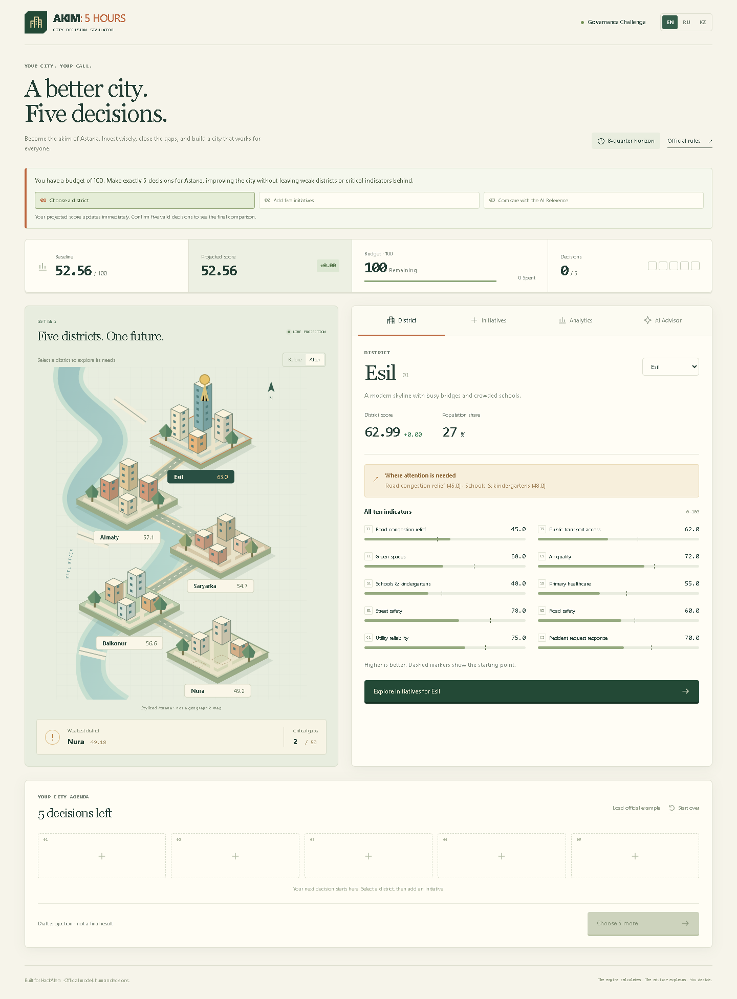
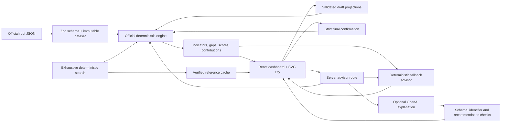
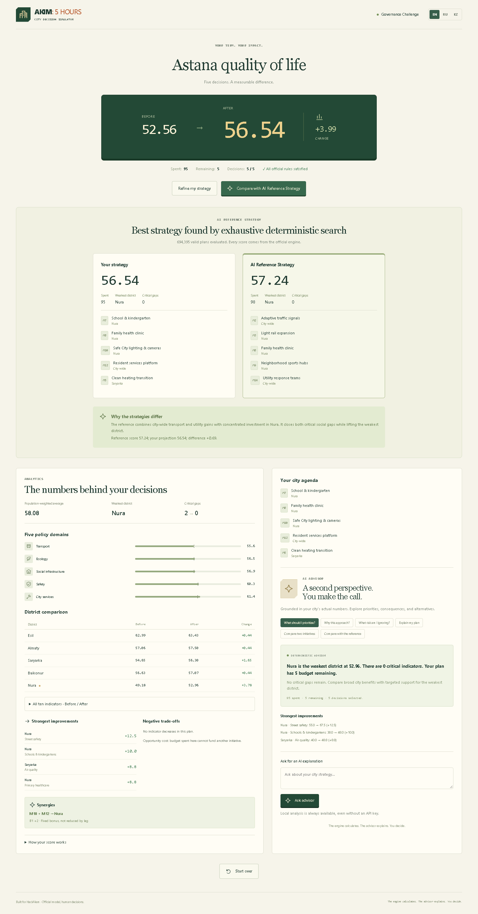

# AKIM: 5 HOURS

**A better city. Five decisions.** Become the akim of Astana, invest a fixed budget, and discover how urban policy changes everyday life.

AKIM combines a deterministic policy engine, an interactive city, and explainable decision support. Every official cost, effect, conflict, and score comes from the supplied dataset and tested code. **The LLM does not calculate official scores or numeric effects.**



## Problem and solution

Urban investments compete for limited resources. A project that improves the city average can still leave its weakest neighborhood behind. AKIM makes these trade-offs visible: five districts, ten indicators, fourteen initiatives, and exactly five decisions.

The main loop is **Observe → Decide → Simulate → Understand → Adjust**. The player keeps final authority; the advisor supplies a second perspective.

## Play locally

Requires **Node.js 24+** and **pnpm 11.19.0**.

```powershell
pnpm install --frozen-lockfile
pnpm dev
```

Open [http://localhost:3000](http://localhost:3000). The full game and local advisor work without API keys. On a standard Node installation, pnpm can be installed with `npm install --global pnpm@11.19.0`.

On the supplied workstation, npm is not on PATH. Use its bundled pnpm directly:

```powershell
node 'C:\Users\Lab-105-Adil\.cache\codex-runtimes\codex-primary-runtime\dependencies\node\node_modules\pnpm\bin\pnpm.cjs' run dev
```

Production:

```powershell
pnpm build
pnpm start
```

No database, Docker, account, or external art download is required. System fonts and locally authored SVG/CSS keep the application self-contained.

## Main user flow

1. Inspect the initial **52.56** quality-of-life score, budget, and critical gaps.
2. Select a district on the city map or in the district selector.
3. Read its ten indicators and weakest areas.
4. Open **Initiatives**, choose a target, and add actions. Unavailable actions explain their conflicts, budget, or domain constraint.
5. Watch the score, indicators, budget, visual overlays, and synergies update.
6. Review your agenda and confirm exactly five valid decisions.
7. Inspect before/after results and compare with the cached AI Reference Strategy.
8. Use the advisor and switch between **EN / RU / KZ** at any time.

Refresh intentionally starts a fresh challenge. There are no saved accounts or sessions.

## Hackathon requirements coverage

| Requirement | Implementation | How to verify |
| --- | --- | --- |
| Fixed virtual budget | Dataset-driven budget, spending, and remaining balance | Header → Budget and agenda |
| Five urban directions | Transport, ecology, social infrastructure, safety, city services | Initiatives → domain filters |
| Exactly five decisions | Strict final validator requires five unique choices | Header counter and Confirm city strategy |
| Budget/domain/conflict prevention | Every draft is validated before it enters the plan | Add an unavailable initiative; its reason is shown |
| Decisions change indicators and Score | Lagged effects feed district and city projections | Add an initiative → live score and indicators update |
| Final Astana Quality of Life Score | Population-weighted average, weakest district, critical-gap penalty | Results → Before → After |
| Five districts | Interactive keyboard-accessible SVG district map | Select any district on the map |
| Official dataset and reproducibility | Runtime Zod validation, locked dependencies, regression and browser tests | `official-dataset.json`, `pnpm test`, `pnpm test:e2e` |
| AI analysis | Optional server-side OpenAI explanation plus deterministic fallback | AI Advisor → Ask advisor |
| Strengths, risks, and trade-offs | Engine-grounded advisor evidence and result analytics | AI Advisor or Analytics |
| AI recommendations | Candidate actions are validated and ranked from actual projections | AI Advisor → Suggested next moves |
| AI Reference Strategy | Exhaustive deterministic search, cached after 694,395 valid plans | Results → Compare with AI Reference Strategy |
| Multilingual UI | Same UI and local advisor in EN, RU, and KZ | Header language switch |
| District visualization | Illustrative five-district map with before/after scores | Main map → Before / After |

## Architecture



The approved simulation engine remains in `src/lib/simulation/` and was not rewritten. It has no React, Next.js, network, clock, randomness, or AI dependency.

New planning functions compose its existing validator, effects, and scorer. A draft can be projected before all decisions are chosen, but it is visibly labelled a **draft**. The official `simulatePlan` still returns `score: null` for an incomplete or invalid Governance Challenge. Confirmation always uses that strict function.

## Deterministic model

The unmodified root `official-dataset.json` is the numeric source of truth. Zod validates its shape, finite values, bounds, weight totals, population shares, lag, rule references, and cross-field consistency.

For each initiative:

```text
realized_fraction = (horizon - lag) / horizon
realized_effect = full_effect × realized_fraction
new_indicator = clip(baseline + direct_effects + fixed_synergy_bonuses)
district_score = sum(indicator_weight × new_indicator)
city_average = sum(population_share × district_score)
critical_count = number of district/indicator cells strictly below 40

Score = 0.7 × city_average + 0.3 × weakest_district_score − 1.0 × critical_count
```

The code reads coefficients and thresholds from the dataset. The final formula is stored as text in the source, so a restricted parser extracts its coefficients without `eval`. The descriptive baseline/example fields never drive the calculation.

Direct effects are summed in dataset action order, synergies are added once without lag scaling, then values are clipped. Internal precision is retained; UI values are rounded only for display. Consequently, the displayed score delta may differ by a hundredth from subtracting two already-rounded displays.

### Reproduced official values

| Metric | Baseline | Official example |
| --- | ---: | ---: |
| Esil | 62.99 | 63.4275 |
| Almaty | 57.06 | 57.4975 |
| Saryarka | 54.65 | 56.3 |
| Baikonur | 56.63 | 57.0675 |
| Nura | 49.18 | 52.9625 |
| Population-weighted average | 56.8624 | 58.0776 |
| Critical gaps | 2 | 0 |
| Final score | **52.55768** | **56.54307** |

The source example costs **95**: M7 → Nura, M8 → Nura, M10 → Nura, M12 → City, M5 → Saryarka.

Its calculated result differs from the source's **≈56.5** by **+0.04307**, consistent with one-decimal rounding. Neither result is hardcoded into the engine.

## AI Reference Strategy

The reference is calculated **without an LLM**. The search enumerates each five-action combination and every district assignment once. It prunes only budget/domain branches that cannot become valid. Every completed candidate reaches the official validator; every valid candidate is scored by the unchanged official simulator.

The completed run examined **842,790** leaf candidates and simulated **694,395** valid plans in approximately **9.04 seconds** on this workstation. This is an offline generation step, not a page-load or API request. The result is committed as a derived local JSON cache with a dataset SHA-256 fingerprint. Runtime checks recalculate its validity and score, and tests verify the dataset fingerprint.

The UI accurately labels the result **“Best strategy found by exhaustive deterministic search.”** This statement applies to the finite official model, not to real-world urban policy.

| Decision | Target |
| --- | --- |
| M2 — Adaptive traffic signals | City |
| M3 — Light rail expansion | Nura |
| M8 — Family health clinic | Nura |
| M9 — Neighborhood sports hubs | Nura |
| M14 — Utility response teams | City |

**Score: 57.236735 → 57.24. Cost: 98.** Both critical gaps are closed; Nura remains the weakest district.

```powershell
pnpm reference:benchmark
pnpm reference:build
```

The benchmark deliberately stops early and labels its result bounded. Only a completed run writes the exhaustive cache. Do not use that benchmark sample as the reference result.

## Advisor architecture

### Always-available local advisor

The fallback uses real projections to explain the weakest district, critical gaps, largest improvements, negative consequences, budget, triggered synergies, and player/reference differences.

Next-move suggestions enumerate available action/target pairs, validate them, and rank their actual draft projections by immediate score gain. This greedy ranking is explicitly labelled; it does not claim the best final plan. Alternative comparison independently adds each selected initiative to the current draft. A full plan must be edited before another action can be added.

### Optional OpenAI explanations

Copy the environment example only if using external AI:

```powershell
Copy-Item .env.example .env.local
```

Set server-side values:

```dotenv
OPENAI_API_KEY=
OPENAI_MODEL=
```

Choose a model available to your account that supports Responses API structured outputs, then restart the server. There is intentionally no assumed model default. With either value missing, the server returns useful deterministic advice.

The route independently validates the plan and calculates all facts on the server. OpenAI receives those facts, available candidates, alternatives, and the already-calculated reference. It is instructed to explain qualitatively in the chosen language, never calculate or search.

The integration follows the [official structured outputs documentation](https://developers.openai.com/api/docs/guides/structured-outputs). Responses are checked with Zod. Unsupported recommendation pairs are removed; malformed output, refusals, timeouts, unknown identifiers, or numeric prose trigger the fallback. Numeric cards in the UI always come from the engine. This conservative design can fall back even when a model repeats a correct number, because model prose is not trusted as a numeric source.

The optional live provider path has been smoke-tested through the production Advisor route in EN, RU, and KZ. It remains optional: with either value missing or any provider/schema failure, the route returns the deterministic local advisor. The adapter's response handling, payload, failures, and validation are also covered by mocked HTTP-boundary tests.

## Stack and project structure

- Next.js 16.3.5, React 19.3.0, TypeScript 6.0.3
- Zod 4.6.5
- Vitest, ESLint, Playwright, Prettier
- React state, CSS, locally authored SVG; no game engine

```text
official-dataset.json               Official numeric source
MASTER_SPEC_AKIM_5_HOURS.md          Product and model authority
src/app/                           App shell, styles, advisor route
src/components/                    Dashboard, city, analytics, advisor
src/data/                          Runtime schema, loader, derived reference cache
src/lib/simulation/                Approved official engine (unchanged)
src/lib/planning/                  Draft projections and analytics
src/lib/reference/                 Exhaustive search and cache validation
src/lib/advisor/                   Local advisor and optional OpenAI adapter
src/i18n/                          EN / RU / KK dictionaries
tests/                             Unit and regression tests
e2e/                               Complete browser smoke scenario
scripts/                           Score reporting and reference generation
docs/                              Audits, demo instructions, screenshots
```

Next.js generated `AGENTS.md` and `CLAUDE.md` during development. They are tooling guidance, not product features.

## Tests and build

```powershell
pnpm test
pnpm typecheck
pnpm lint
pnpm build
pnpm test:e2e
pnpm report:scores
```

Browser tests use installed Google Chrome and start a separate production server on port **3100**, with OpenAI configuration explicitly empty. Build first. They cover the entire five-decision flow, a blocked incompatibility, results, reference comparison, no-key advisor, RU/KZ switching, refresh, JavaScript errors, and narrow-screen overflow.

To test an already-running development server:

```powershell
$env:TEST_BASE_URL = 'http://127.0.0.1:3000'
pnpm test:e2e
```

The original **73 tests remain unchanged**. New tests cover exhaustive enumeration against an independent Cartesian oracle, reference validity and score, draft strictness, suggestions, analytics, translations, advisor contracts, provider failures, and route validation. See [the completion report](docs/P0_COMPLETION.md) for final counts and gate results.

## Reproducible 3–5 minute demo

See [the exact demo script](docs/DEMO.md). The short path is:

**Nura → Initiatives → build the official example → Analytics → confirm → compare with reference → Advisor → RU / KZ.**

The **Load official example** control is a recovery shortcut that loads decisions through the real engine; it does not substitute a fabricated result.



## Dataset and security

The supplied Master Spec and root dataset are preserved byte-for-byte. The reference cache is derived, and the map is an illustrative city—not GIS or empirical geography. Scores are outcomes of the supplied hackathon model.

Keys are never accepted from the browser and never included in client props, client bundles, or model context. There is no `NEXT_PUBLIC_` key. Requests are size-bounded, schema-validated, checked for matching browser origin/host, and limited to two concurrent external calls per server process. Provider requests time out. React renders text safely; no raw model HTML is inserted.

The project needs no personal data. External calls occur only after the user presses the advisor request button and credentials are configured. Those calls send the question and simulation context to OpenAI. Without credentials, the game has no dependency on an external AI service.

## Known limitations and deliberate omissions

- Refresh resets the challenge and language to the initial state. No saved sessions, accounts, database, or leaderboard.
- Qualitative OpenAI prose is not a formal guarantee; calculations and displayed numbers remain deterministic. A provider timeout or validation failure returns the local advisor.
- The local fallback is structured analysis, not a general-purpose conversational model.
- Next-action suggestions optimize the immediate projection, not all completions of a draft.
- The illustrative district map uses simplified geometry and symbolic markers; it does not model real buildings or geography.
- Exhaustive regeneration takes about nine seconds locally. The UI reads the cached result immediately.
- Kazakh/Russian essential strings are implemented; native-speaker editorial review is advisable before a public release.
- ESLint 9 is deprecated upstream but matches the current Next.js lint plugins' peer requirements. TypeScript 6 is pinned for their supported range.
- The API has basic local-demo safeguards, not durable public-service rate limiting or abuse protection.
- No Sandbox, Crisis Mode, NVIDIA/Brev, authentication, multiplayer, real GIS, WebGL, heavy game engine, complex animations, or presentation generation.

Future work can add persisted local sessions, native-speaker review, more map detail, an authenticated hosted deployment with robust rate limiting, and separately labelled experimental modes. None is necessary for the official challenge demo.

## Manual upload

The source package excludes dependencies, builds, caches, traces, and local environment files. Upload the extracted source files, including the root dataset, Master Spec, dotfiles, lockfile, and documentation. Do not upload `node_modules`, `.next`, `.pnpm-store`, or `.env.local`.

No Git repository was initialized and no GitHub connection, remote repository, or upload was created by this task.
